DevOps Pipelines
============

## Index
1. Overview 
2. Azure DevOps
    - 2.0 What is
    - 2.1 Set up your organization
        - 2.1.0 Set up your DevOps project
3. Infrastructure as Code
    - 3.0 What is
    - 3.1 Terraform
    - 3.2 Prerequisites
        - 3.2.1 Installation
        - 3.2.2 Create Manual Resources 
     - 3.3 IaC generic template
     - 3.4 Implementing IaC 
        - 3.4.0 Create and set up IaC project 
        - 3.4.1 Set up your Azure Pipelines
                - 3.2.3.0 Create Service Connections
        - 3.4.2 Implement Azure Pipeline Deploy
        - 3.4.3 Implement Azure Pipeline Destroy    
4. Continuous Integration
5. Continuous Delivery
6. References


### 1. Overview 
In this repository you will find generic templates to implement Infrastrcure as Code, Continuous Integration, and Continuous Delivery. These templates are made to work with Azure Pipelines  


### 2. Azure DevOps

#### 2.0 What is 
Azure DevOps Server <sub><sup>[5]</sup></sub> is a Microsoft product that provides version control, reporting, requirements management, project management, automated builds, testing and release management capabilities. It covers the entire application lifecycle, and enables DevOps capabilities

#### 2.1 Set up your organization

- Search DevOps in your Azure Home 
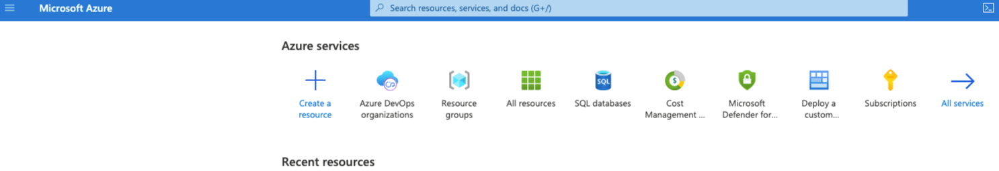

- Click on 'Azure DevOps organizations'
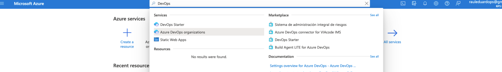


- Select 'My Azure DevOps Organizations', then 'Create new organization'


- Fill the values for your organization, and 'Continue'
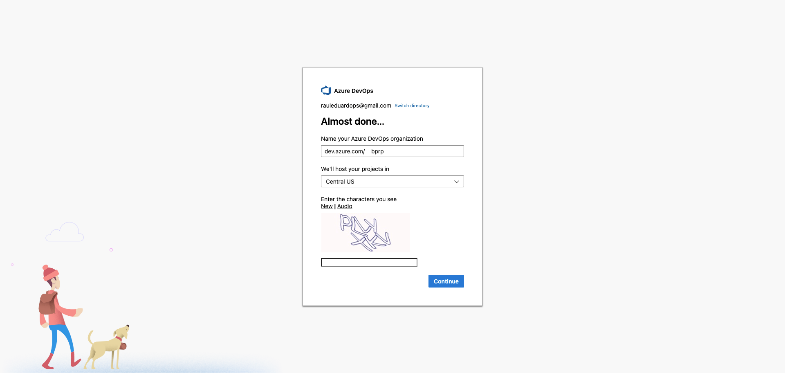

- Finally, create a project call 'DevOps'
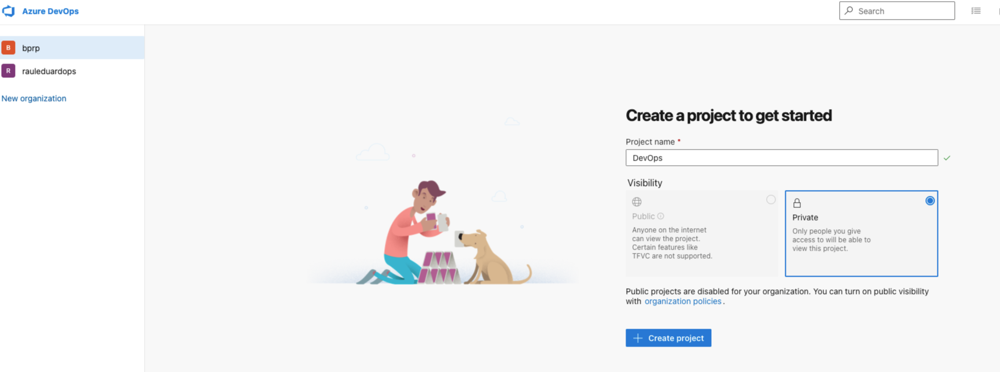

#### 2.1.0 Set up your DevOps project
Azure Repos <sub><sup>[6]</sup></sub> is a set of version control tools that you can use to manage your code. Whether your software project is large or small, using version control as soon as possible is a good idea.

- Go to your Azure DevOps organization https://dev.azure.com/bprp/

- Select 'DevOps' project
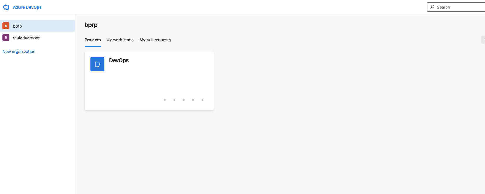

- Select 'Repos' option
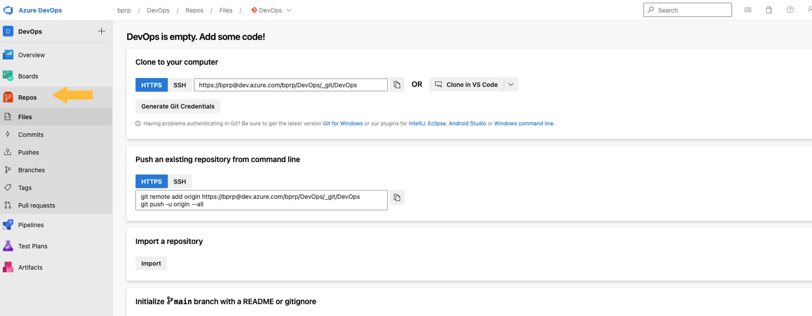

- Create a new repository called 'pipeline-library'
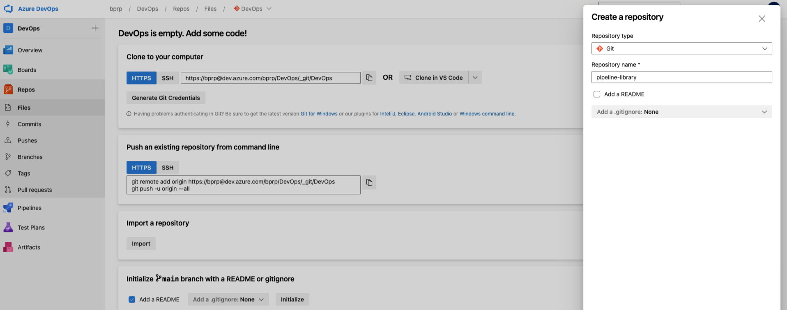

- Upload the content of the folder pipeline-library in this repository
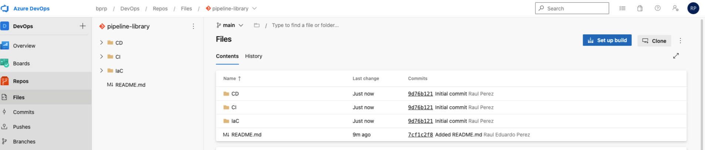


### 3. Infrastructure as Code

#### 3.0 What is 
Infrastructure as code is the process of managing and provisioning computer data centers through machine-readable definition files, rather than physical hardware configuration or interactive configuration tools.

#### 3.1 Terraform 
Hashicorp Terraform <sub><sup>[1]</sup></sub> is an open-source tool for provisioning and managing cloud infrastructure. It codifies infrastructure in configuration files that describe the topology of cloud resources. These resources include virtual machines, storage accounts, and networking interfaces. The Terraform CLI provides a simple mechanism to deploy and version the configuration files to Azure .

#### 3.2 Prerequisites
In order to use Terraform in your Azure DevOps organization, you will need to do some tasks before.

#### 3.2.1 Installation

To improve Terraform integration with Azure Pipelines, it's necessary yo install the Terraform extension in you Azure DevOps organization

- Go to Visual Studio Marketplace <sub><sup>[3]</sup></sub>

- Search 'Terraform' extension by Microsoft DevLabs
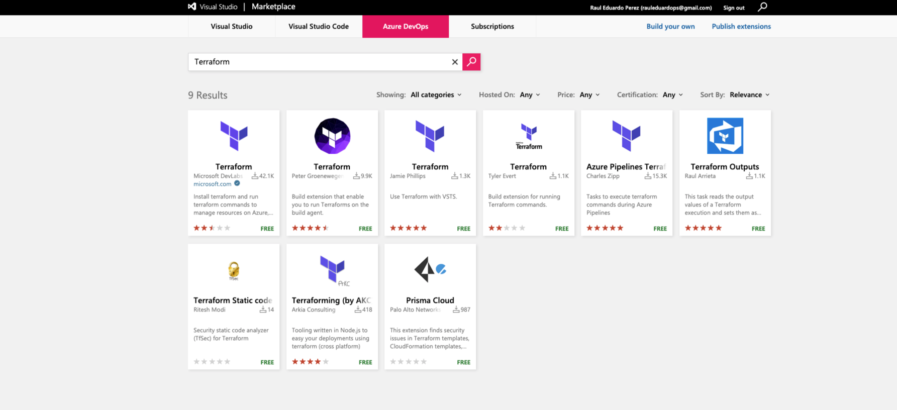

- Select 'Get it free'

- Then, select your Azure DevOps organization
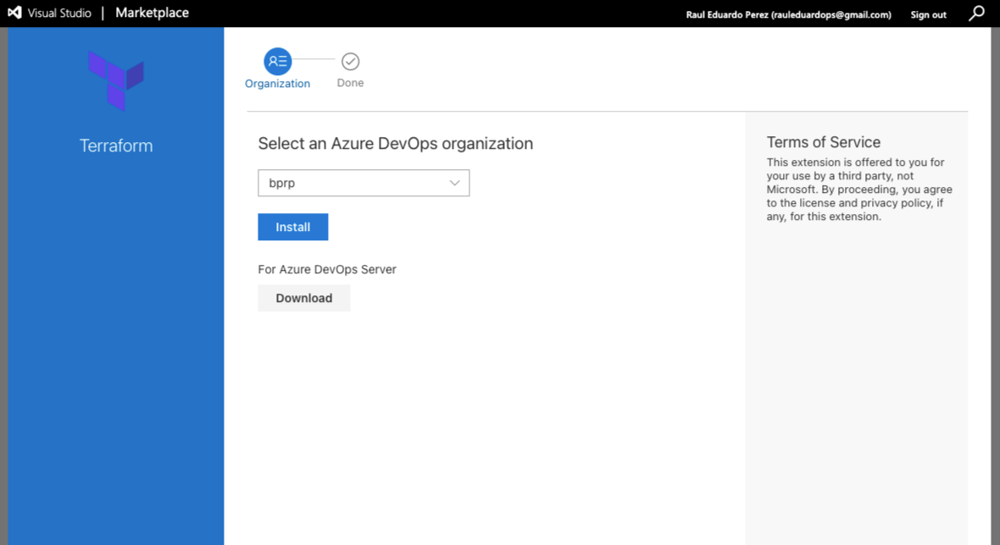

- Click on 'Install', then 'Proceed to organization'

#### 3.2.2 Create Manual Resources

Create some resources in your Azure account:

-  Resource group 
```console
az group create -l centralus -n devopsRG
```

- Azure Storage Account
```console
az storage account create --resource-group devopsRG --name terraformrpasa --sku Standard_LRS --encryption-service blob
```

- Azure Storage Container
First, get the string connections of the storage account created before
```console
az storage account keys list --resource-group devopsRG --account-name terraformrpasa
```

Create the container using the value of {key1}
```console
az storage container create --name terraformrpasa --account-name terraformrpasa --account-key {key1}
```

#### 3.3 IaC generic template

IaC-Pipeline-Template.yaml is a generic template that can be used to DEPLOY all kind of resource on Azure Cloud and Terraform. This was develop following Pipeline as code practice<sub><sup>[7]</sup></sub>


#### 3.4 Implementing IaC

#### 3.4.0 Create and set up IaC project  

- Go to your Azure DevOps organization https://dev.azure.com/bprp/

- Click 'New project' 
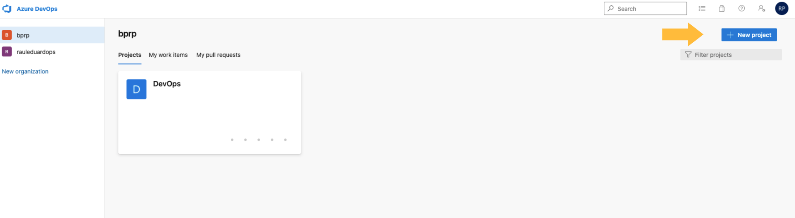

- Complete 'Project name' with IaC, and 'create'
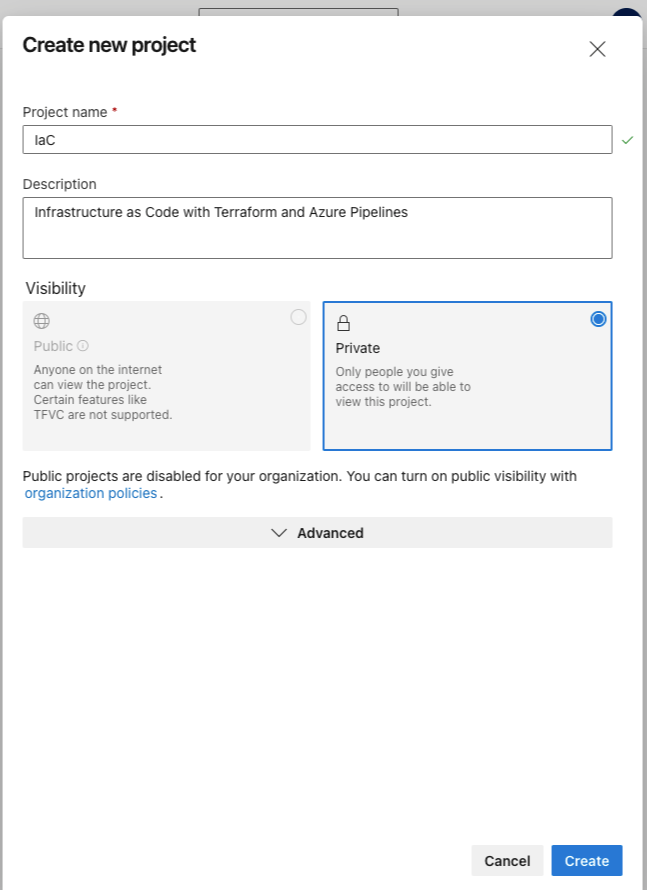


- Select 'Repos' option


- Create a new repository called 'iac-demo'


- Upload the content of the folder iac-demo in this repository


#### 3.4.1 Set up your pipelines 

##### 3.4.1.0 Service Connections for Azure Pipelines
You can create a connection<sub><sup>[6]</sup></sub> from Azure Pipelines to external and remote services for executing tasks in a job. Once you establish a connection, you can view, edit, and add security to the service connection.

######Azure Resource Manager service connection 
- Go to your 'Project Settings'
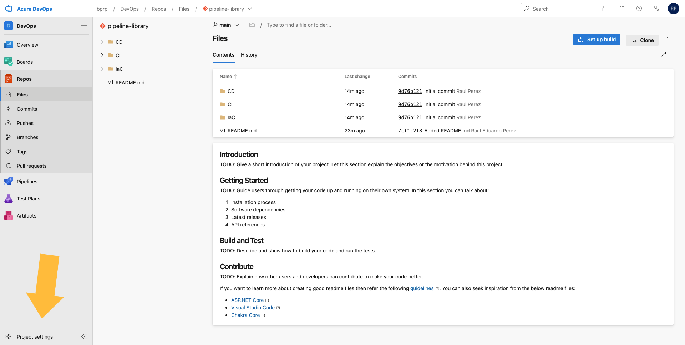

- Under 'Pipeline' section, select 'Service Connections', then 'Create service connection'
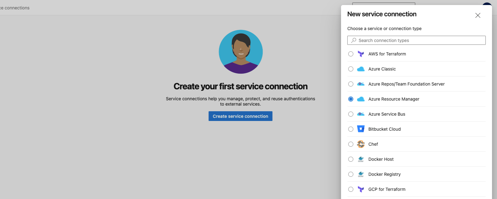

- Check 'Service Principal (automatic)' in Authentication Method, and 'Next'
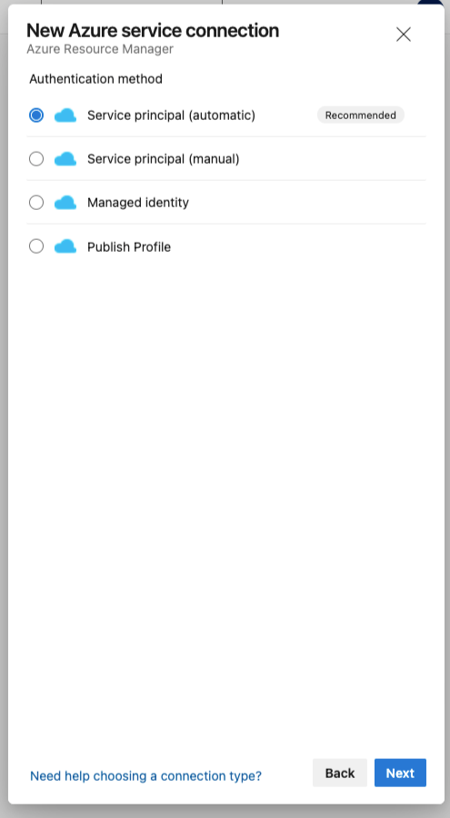

- Complete the service connection name with 'terraformfull-sc'
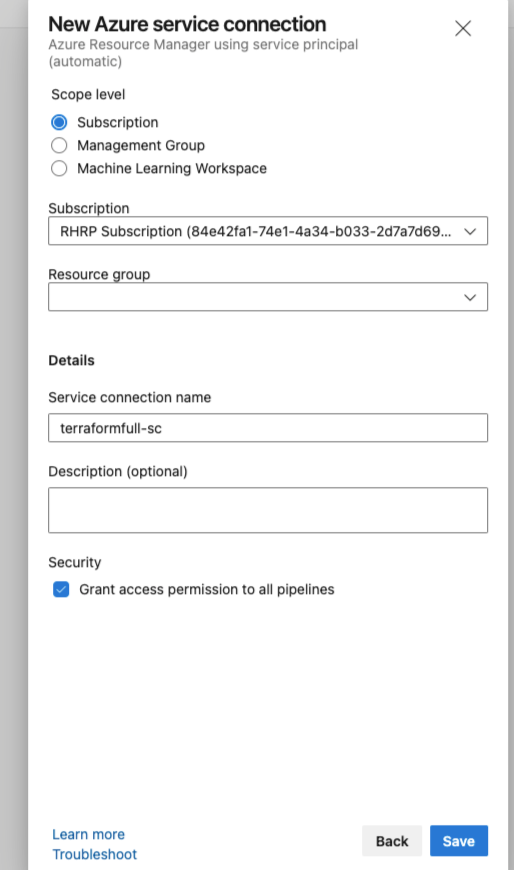

#### 3.4.2 Implement Azure Pipeline Desploy

- Go to IaC project https://dev.azure.com/bprp/IaC, then select 'Pipelines' 
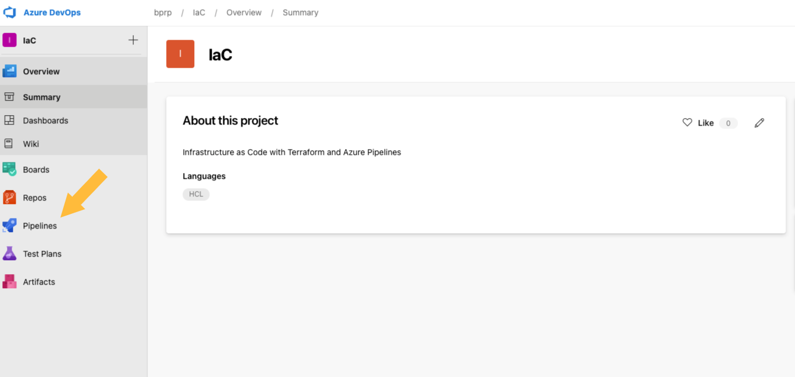

- Click on 'Create Pipeline'

- Select your code repository, then select 'iac-demo' 
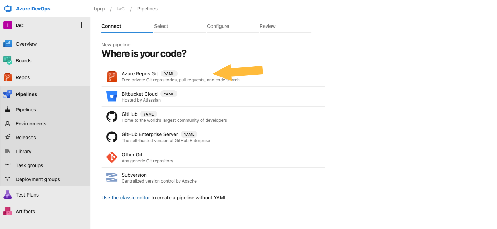

- Configure your pipeline using 'Existing Azure Pipeline YAML file'
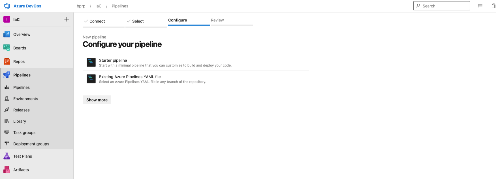

- Select your yaml implementation
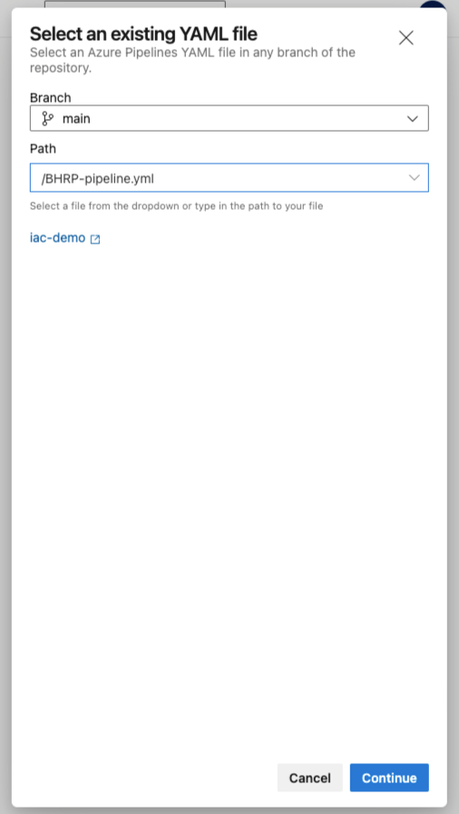

- Review your pipeline implementation, then click on 'Run'
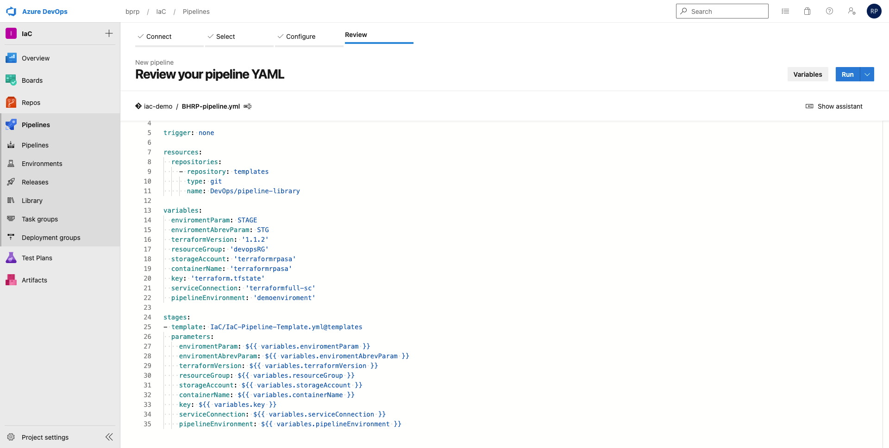

- Wait results, and validate!
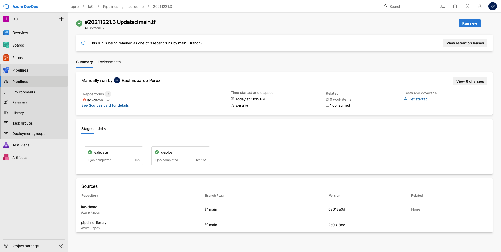

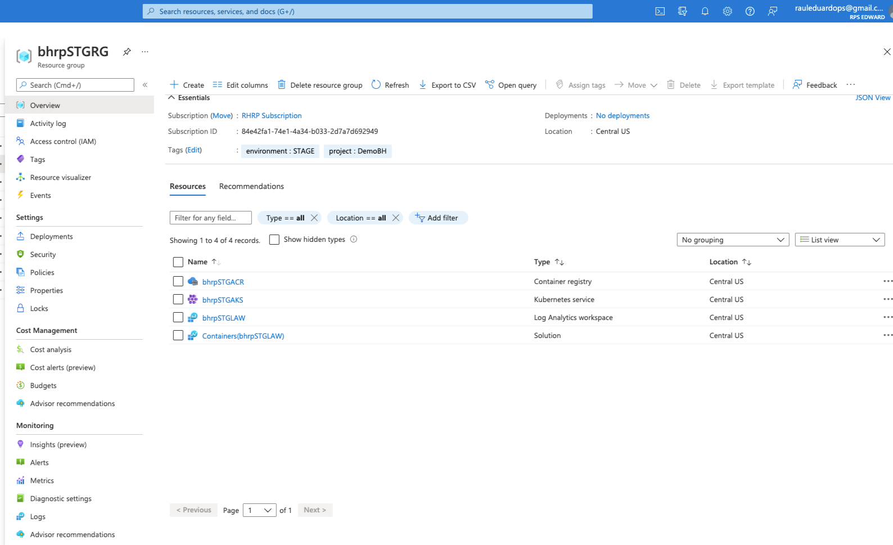

#### 3.4.3 Implement Azure Pipeline Destroy

- Go to IaC project https://dev.azure.com/bprp/IaC, then select 'Pipelines' 


- Click on 'Create Pipeline'

- Select your code repository, then select 'iac-demo' 


- Configure your pipeline using 'Existing Azure Pipeline YAML file'


- Select your yaml implementation 'BHRP-terraform-destroy.yaml'


- Review your pipeline implementation, then click on 'Run'
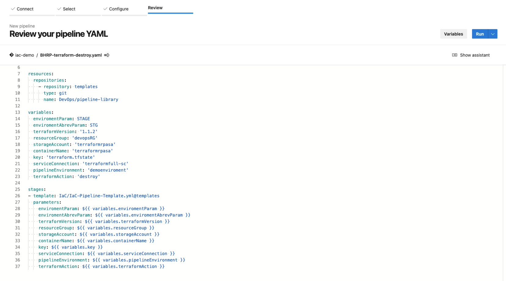

- Wait results, and validate!


### 6. References
<sub><sup>[1]</sup></sub> Terraform https://www.terraform.io/

<sub><sup>[2]</sup></sub> Terraform with Azure https://docs.microsoft.com/en-us/azure/developer/terraform/overview

<sub><sup>[3]</sup></sub> Extensions for Azure DevOps https://marketplace.visualstudio.com/azuredevops

<sub><sup>[4]</sup></sub> Terraform by Microsoft DevLabs https://marketplace.visualstudio.com/items?itemName=ms-devlabs.custom-terraform-tasks

<sub><sup>[5]</sup></sub> Azure DevOps https://azure.microsoft.com/en-us/services/devops/

<sub><sup>[6]</sup></sub> Azure DevOps Repos https://docs.microsoft.com/en-us/azure/devops/repos/?view=azure-devops

<sub><sup>[6]</sup></sub> Azure DevOps Service Connection https://docs.microsoft.com/en-us/azure/devops/pipelines/library/service-endpoints?view=azure-devops&tabs=yaml

<sub><sup>[7]</sup></sub> Pipeline as code https://about.gitlab.com/topics/ci-cd/pipeline-as-code/